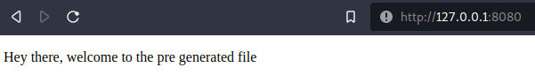

```

________/\\\\\\\\\________________________________________________________________________/\\\\\\____        
 _____/\\\////////________________________________________________________________________\////\\\____       
  ___/\\\/____________________________/\\\__/\\\__________________/\\\________________________\/\\\____      
   __/\\\______________/\\/\\\\\\\____\//\\\/\\\___/\\\\\\\\\\__/\\\\\\\\\\\__/\\\\\\\\\_______\/\\\____     
    _\/\\\_____________\/\\\/////\\\____\//\\\\\___\/\\\//////__\////\\\////__\////////\\\______\/\\\____    
     _\//\\\____________\/\\\___\///______\//\\\____\/\\\\\\\\\\____\/\\\________/\\\\\\\\\\_____\/\\\____   
      __\///\\\__________\/\\\__________/\\_/\\\_____\////////\\\____\/\\\_/\\___/\\\/////\\\_____\/\\\____  
       ____\////\\\\\\\\\_\/\\\_________\//\\\\/_______/\\\\\\\\\\____\//\\\\\___\//\\\\\\\\/\\__/\\\\\\\\\_ 
        _______\/////////__\///___________\////________\//////////______\/////_____\////////\//__\/////////__
                                ⠀⠀⠀⠀⠀⠀⠀⠀⠀⠀⠀⠀⠀⠀⣠⡀⠀⠀⠀⠀⠀⠀⠀⠀⠀⠀⠀⠀⠀⠀
                                ⠀⠀⠀⠀⠀⠀⠀⠀⠀⠀⠀⠀⣠⣾⣿⣿⣦⡀⠀⠀⠀⠀⠀⠀⠀⠀⠀⠀⠀⠀
                                ⠀⠀⠀⠀⠀⠀⠀⠀⠀⠀⢀⣼⣿⣿⣿⣿⣿⣿⣄⠀⠀⣠⡾⠀⠀⠀⠀⠀⠀⠀
                                ⠀⠀⠀⠀⠀⠀⠀⠀⠀⠀⢸⣿⣿⣿⣿⣿⡏⢹⣿⠀⣾⣿⠇⠀⢀⣀⡄⠀⠀⠀
                                ⠀⠀⠀⠀⠀⢀⣾⣦⣄⠀⠸⣿⣿⣿⣿⣿⡇⢸⣿⠀⠋⣠⣴⣾⣿⣿⣿⡀⠀⠀
                                ⠀⠀⠀⠀⢀⣾⣿⣿⣿⣷⣦⣈⠙⢿⣿⣿⡇⢸⡏⠀⢠⣿⣿⣿⣿⣿⣿⣧⠀⠀
                                ⠀⠀⠀⢀⣾⣿⣿⣿⣿⣿⡉⢻⡆⢸⣿⣿⠁⢸⡇⢀⣿⣿⣿⣿⡿⠁⣽⠏⠀⠀
                                ⠀⠀⠀⠈⣿⣿⣿⣿⣿⣿⡇⢸⣇⠈⣿⣿⠀⣸⠁⣾⣿⣿⣿⡿⠁⣼⠃⠀⠀⠀
                                ⠀⠀⠀⠀⢻⣿⣿⣿⣿⣿⣿⠘⣿⠀⢻⣿⠀⠂⣸⣿⣿⣿⡿⠁⣼⠏⠀⠀⠀⠀
                                ⠀⠀⠀⠀⠘⣿⣿⣿⣿⣿⣿⠀⢿⡇⢸⣿⠀⢰⣿⣿⣿⡟⢁⣾⠏⠀⠀⠀⠀⠀
                                ⠀⠀⠀⠀⠀⢻⣿⣿⣿⣿⣿⡆⢸⣷⠀⡏⢠⣿⣿⣿⡟⢀⣾⠏⠀⠀⠀⠀⠀⠀
                                ⠀⠀⠸⣷⣆⠘⣿⣿⣿⣿⣿⣧⠈⣿⡀⢀⣾⣿⣿⡟⢀⣾⠏⢠⣴⣾⠃⠀⠀⠀
                                ⠀⠀⠀⢻⣿⡄⢹⣿⣿⣿⣿⣿⡀⢻⡇⠘⣿⣿⡟⢀⣾⠏⢠⣿⣿⡏⠀⠀⠀⠀
                                ⠀⠀⠀⠈⣿⣧⠈⣿⣿⣿⣿⣿⡇⠸⣿⠀⣿⡿⠁⣾⠏⣠⡿⠟⠋⠀⠀⠀⠀⠀
                                ⠀⠀⠀⠀⠙⠛⠀⠘⠛⠛⠛⠛⠓⠀⠛⠀⠘⠁⠘⠋⠀⠁⠀⠀⠀
```

# Introduction 

This repo will be an explanation of using a small router module i made in crystal for you to use. In this example i made a small HTTP file server defining multiple routes using the crystal programming language. There are 4 total files which i will go over in just a minute. Do note that the actual server.cr file has been modified to handle HTTP POST and GET requests uniquely so has the HTML.

# Creating our application

the application looks like the following file tree 

```
├── HTML
│   ├── example.html
│   └── main.html
├── router.cr
└── src
    ├── Responder.cr
    ├── Server.cr
    └── Template.cr
```

### the example.html file ###

Our server consists of 4 crystal source code files, and 2 main HTML files. for our sense lets focus on building our application first. Lets head over into the HTML directory and open example.html which holds the following html code.

```html
<!DOCTYPE html>
<html lang="en">
<head>
    <meta charset="UTF-8">
    <title>Form</title>
</head>
<body>
    <form action="/" method="POST" enctype="multipart/form-data">
        <label for="fname">Filename</label><br>
        <input type="text" id="fname" name="fname"><br>
        <button type="submit" value="submit">Submit</button>
      </form> 
</body>
</html>
```

This code is pretty basic HTML, even someone who has never touched HTML should understand this but if you dont here is a small description. Inside of the body tags we create a form tag which is typically a POST FORM, this is the form our server will be parsing the user input of. the action which is defined in `<form action="/"` is to tell the server where to go or what file to go to after the server is sucessfull, in our case once the form is done it will kick you back to the root directory which will be the home page. The method of this HTML form will be a POST since we need to parse a filename from the user input. then the encoding type that is parsed is multipart/form-data if it was not clear we are going to be parsing form data sent by the request. under the form tags we have a lable tag which is just a HTML lable which has the text `Filename` this is what our user will know what to input in the input box. Directly under it speaking of input we call an input box which is type text and has a name or form name `fname` standing for filename. Later on in the actuall server this is the value we need to seek from the body. we call a break line tag with `<br>` and create a simple submit button. If we run our html file on a local server it should look like 


The other html file will be empty just because later on the server will generate this file ( simple template and hardcoded generation ).

### the crystal files ###

The crystal source files contain a few files. In the source or src file directory we have 3 named the following 

* Responder 
* Server 
* Template

Template is a pretty simple one, it holds a module which has a class and a function to generate the text and data for the main.html file aka the file we will see on the server in the `/` dir. The file Template.cr looks like the following code brick below.

```crystal
module Loader
    class Template 
        def fill_simple_Template(x : String)
            tmpl = "HTML/main.html"
            File.open(tmpl, "w") do |f|
                f.print "<!-- This file was generated by the server, do not remove this file unless youa re a developer -->"
                f.print "<!DOCTYPE html>"
                f.print "<html lang='en'>"
                f.print "<head>"
                f.print "<meta charset='UTF-8'>" 
                f.print "<meta http-equiv='X-UA-Compatible' content='IE=edge'>"
                f.print "<meta name='viewport' content='width=device-width, initial-scale=1.0'>"
                f.print "<title>Pre generated template</title>"
                f.print "</head>"
                f.print "<body>"
                f.print "<div>"
                f.print "<p> #{x} </p>"
                f.print "</div>"
                f.print "</body>"
                f.print "</html>"
            end
        end
    end
end
```

I typically would never EVER suggest doing this to a file given that it is insecure and in larger programs this will knock down preformance ALOT but for now lets just keep it. We define a module named `Loader` which holds a class named `Template` which holds a method named `fill_simple_Template` which asks for an argument named X of type string. The HTML template is basically a small template that will just output the value of X whenever we reach the root of the server. Under the function we simply open the file with a write intent then start a do loop to print data to the file. In a real sense this would be a very unstable function again in larger code bases. A good way to patch this would be to store the HTML data in an array and when you reach the formatting stage which is seen here 

` f.print "<p> #{x} </p>"`

then just print that individually or format it inside of the same list and move on. This not only makes the code more robust but run cleaner with less issues in the future. Let us now move onto Responder which is a wacky file.

**Responder.cr**

Responder.cr is exactly what it sounds like, a responder to the server do not get this mixed up with parser. The responder file defines a simple moudle with a class which returns the base root path of the server. Later on in our router we can define routes and through this class and module we can check which route we are at, and what the server should load given the path which looks like the following.

```crystal 
require "./Template.cr"

module Responder 
    class Switcher
        def return_base_path(path_of_file : String)
            server_Locations = {
                "/example" => "HTML/example.html",
                "/"        => "HTML/main.html",
            }
            if path_of_file == "/"
                if File.exists?(server_Locations[path_of_file]) 
                    tem = Loader::Template.new
                    tem.fill_simple_Template("Hey there, welcome to the pre generated file")
                    puts "Template finished....[main.html]"
                end
            end
            server_Locations[path_of_file]
        end
    end
end
```

Our responder.cr files requires the template.cr file because once we define our list of all possible routes and endpoints such as 

```crystal
            server_Locations = {
                "/example" => "HTML/example.html",
                "/"        => "HTML/main.html",
            }
```

we will go onto in a way map out the value. The method asks for one variable of type string which is the path or current location within the server. We will match that up to the current known server locations and their direct files. After we define the known server locations we check if the path of the file or if the directory is the root path or `/` if it is then we check if the file exists which we already know that if the path_of_file is the / directory that our file will match to `HTML/main.html`. If it exists and was not deleted or corrupted we call our class and module from the Template.cr crystal source file. and we call the function to generate the template in the code. Later on if you do this more than once you will NEED to create a method that creates the file onsite and if it does not exist then to continue on with the generation and if it DOES exist then to delete and go back up to the other function where a new method spawns and generates the template. Once that if statement is checked we simply return the value that is matched up with our list of server locations. ( No return keyword is required ). Finally we can move onto the last file which is our Server.cr file. This file will be the biggest one of them all in terms of functionality. Here is the code for the file 

**Server.cr**

```crystal
require "http/server"
require "./Responder.cr"


module Server 
    class Base 
        def initialize
            @router = {

            } of String => ( -> String )
        end

        def run(int port, string filename)
            server = HTTP::Server.new do |ctx|
                ctx.response.content_type = "multipart/form-data"
                ctx.response.content_type = "boundary=aA40"
                req = ctx.request
                if @router.has_key?(req.path.to_s)
                    if req.method == "GET"
                        aoo = Responder::Switcher.new 
                        fo = aoo.return_base_path(req.path.to_s)
                        ctx.response.content_length = File.size(fo.to_s)
                        File.open(fo.to_s) do |f|
                            IO.copy(f, ctx.response)
                        end
                    end 
                    if req.method == "POST"
                            HTTP::FormData.parse(ctx.request) do |part|
                                case part.name
                                when "fname"
                                    puts part.body.gets_to_end
                                end
                            end
                    end
                else 
                    ctx.response.respond_with_status(401, " Not found please return to the root path / #{req.method}")
                end
            end
            server.listen(port)
        end
        def process(router, &block : (-> String))
            @router[router.to_s] = block
        end
    end
end
```

First off like all of our files so far we define a module which for this file is server with a class of base. Base has multiple methods 

*initialize 
*run
*process 

The initialize basically just defines a small router list, this is how we will define our routes. The run function is the ENTIRE brick of it all which has two arguments ( one which is not needed but just added for testing ). The first argument is an integer type of port, this will be the port you want to handle it on, the other is a filename which WAS the index you were going to load but that has since been deprecated. We start a new call to HTTP::Server.new with variables server and aftere the do loop lable a CTX ( context ) which will hold all of the values we get from the server. Under this loop we first do the following, lable our variables.

```crystal
                ctx.response.content_type = "multipart/form-data"
                ctx.response.content_type = "boundary=aA40"
                req = ctx.request
```

the first two are the content types of the server and the boundary, our server will only be excepting miltipart/form-data which if you look back at our example.html file we have the following that the response will have as an encoding type

```html
enctype="multipart/form-data"
```

under that we create a simple if statement which check sif there is a certian key. In our case the `req.path.to_s` is the request path, when we make a request to the server the if statement is basically checking to make sure that is a validated route that is set in the application ( more on that later ). then we check for the method. If the HTTP request method to the server was GET then we create a new variable which calls for our responder and switcher class which again will tell the server what file it needs to return based on the current request path of the server. so if we make a request to `/example` in the server at `http://localhost8080/example` then we will load `example.html` because again the path that was retuned from our method that matched with our list will be that file and path. defined here in Reponder.cr 

```crystal
            server_Locations = {
                "/example" => "HTML/example.html",
                "/"        => "HTML/main.html",
            }
```

Once the file is returned we set the content length, which will be the size of the file. Do note that `to_s` is a conversion to a string from another type, so our file name or path is now a string argument if it was not already. We make a simple call to file to open the file and spawn a do loop, for every value in f which we can say that is the text copy it to the input output function. The IO takes the following arguments ( in our case ) 

```
f ( file text )
HTTP::Server.response
```

The HTTP server response will be the response we get from the server when we load that path, in other cases this is the HTTP response handler and writer. When we copy the data from F onto ctx.response we will now under every GET request that is made display the text of the file that we needed. in the POST check we do something a bit different. Remember in this case we want to take the filename the user inputted and output it to the console on the server side. So we do that by making a call to HTTP::FormData.parse to parse the request.

```crystal
                    if req.method == "POST"
                            HTTP::FormData.parse(ctx.request) do |part|
                                case part.name
                                when "fname"
                                    puts part.body.gets_to_end
                                end
                            end
                    end
```

Do note that if this statement is triggered we already know that the request is a POST request so we know that the body of the request will be a POST request. So we parse the data now that we know its a HTTP form, and call a do loop then a case statement. the case statement will basically act as a switch statement. in other languages the case statement would be 

```
switch(value)
```

so we are checking part.name which is the field value parsed from the FormData parser. when the field is `fname` which was defined in our HTML 

```html
<input type="text" id="fname" name="fname"><br>
```

then put or print the part.body ( response body ) until the end of input which is told when we call `gets_to_end`. Once 
that is finished we will simply continue out and call the server to respond with status 401 or NOT FOUND and to return to the root filepath if the path is not in the defined route. defined here 

```crystal
                else 
                    ctx.response.respond_with_status(401, " Not found please return to the root path / #{req.method}")
                end
```

after that we call the server to listen on the given port and define a function called process. Process is our entire processor, this will set the routes for the server and call router to format the arguments which is seen below.

```crystal
        def process(router, &block : (-> String))
            @router[router.to_s] = block
        end
```

We have finally reached the end, let us now finally end with the router.cr file which looks like the following.


```crystal
require "./src/Server"

puts "Application running"

application = Server::Base.new
application.process "/" do
    ""
end
application.process "/example" do  ""
end


application.run(8080, "example.html")
```

with our newly modified router we can require the server file and make a call to the applications base. When we call the new method for the module class we set our routes ( keep in mind for now they must return a string ). We use the application.process to set our router and create a do block. These blocks do nothing but determine the routes. Remember how we had that list and i talked about the router? well the router.cr is it.

for every route we add we must add to the server locations from the Responder.cr file.

```crystal
            server_Locations = {
                "/example" => "HTML/example.html",
                "/"        => "HTML/main.html",
            }
```

if we were to call application.process "/app" we would have to make a new method and filepath for the server.

In general this is pretty simple, once we set our routes we call the run method and tell it to run on port 8080. When we start our server we will see the following in the `/` server.



and on the console 

`Template finished....[main.html]`

if we head to `/example` we see the following 


and if we look at the console once we submit the file

```
somefile.txt
```


